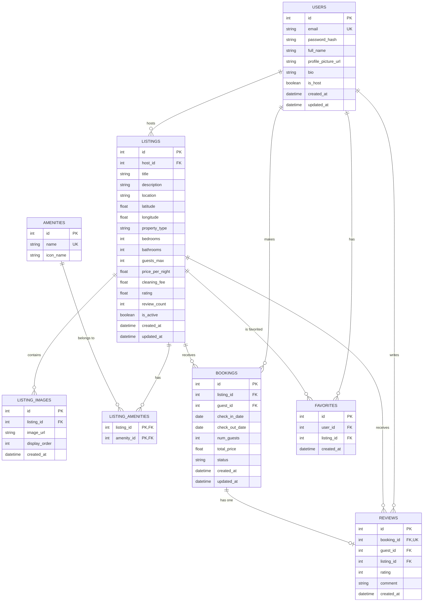

# Airbnb Clone Database Schema 

```mermaid
erDiagram
    USERS {
        int id PK
        string email UK
        string password_hash
        string full_name
        string profile_picture_url
        string bio
        boolean is_host
        datetime created_at
        datetime updated_at
    }

    LISTINGS {
        int id PK
        int host_id FK
        string title
        string description
        string location
        float latitude
        float longitude
        string property_type
        int bedrooms
        int bathrooms
        int guests_max
        float price_per_night
        float cleaning_fee
        float rating
        int review_count
        boolean is_active
        datetime created_at
        datetime updated_at
    }

    LISTING_IMAGES {
        int id PK
        int listing_id FK
        string image_url
        int display_order
        datetime created_at
    }

    AMENITIES {
        int id PK
        string name UK
        string icon_name
    }

    LISTING_AMENITIES {
        int listing_id PK, FK
        int amenity_id PK, FK
    }

    BOOKINGS {
        int id PK
        int listing_id FK
        int guest_id FK
        date check_in_date
        date check_out_date
        int num_guests
        float total_price
        string status
        datetime created_at
        datetime updated_at
    }

    REVIEWS {
        int id PK
        int booking_id FK, UK
        int guest_id FK
        int listing_id FK
        int rating
        string comment
        datetime created_at
    }

    FAVORITES {
        int id PK
        int user_id FK
        int listing_id FK
        datetime created_at
    }

    USERS ||--o{ LISTINGS : "hosts"
    USERS ||--o{ BOOKINGS : "makes"
    USERS ||--o{ REVIEWS : "writes"
    USERS ||--o{ FAVORITES : "has"
    
    LISTINGS ||--o{ LISTING_IMAGES : "contains"
    LISTINGS ||--o{ BOOKINGS : "receives"
    LISTINGS ||--o{ REVIEWS : "receives"
    LISTINGS ||--o{ FAVORITES : "is favorited"
    
    LISTINGS ||--o{ LISTING_AMENITIES : "has"
    AMENITIES ||--o{ LISTING_AMENITIES : "belongs to"
    
    BOOKINGS ||--o| REVIEWS : "has one"
```
